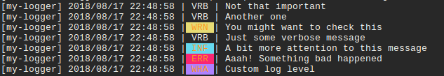

# logm

Logm is a fairly simple logger that supports log levels and colored output (inspired by [gin-gonic/gin's logger](https://github.com/gin-gonic/gin/blob/master/logger.go)).

## Usage

**go get** this package:

```
go get github.com/mc0239/logm
```

Import logm package and make an instance of logm.Logm:

```go
// import package
import "github.com/mc0239/logm"

// make an instance
lgr := logm.New("my-logger")
```

Start using logm!

```go
lgr.LogV("A verbose log message")
lgr.LogI("Some info")
lgr.LogW("Hold up! It's a warning")
lgr.LogE("Something has gone wrong")
lgr.Log("WHAT", "Custom log level")
```

## Example



## Customizing

Logm is a one file, about 100 lines, package. You can copy it into your project and customize the logger as you please :)

## License

MIT