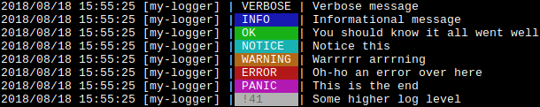
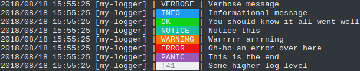
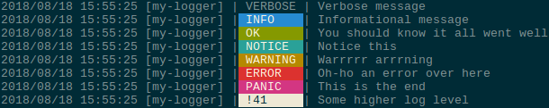
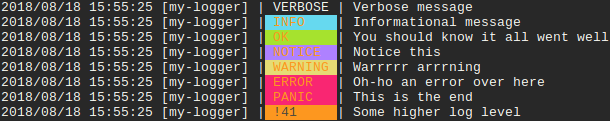

# logm

Logm is a fairly simple logger that supports log levels and colored output (inspired by [gin-gonic/gin's logger](https://github.com/gin-gonic/gin/blob/master/logger.go)).

## Usage

**go get** this package:

```
go get github.com/mc0239/logm
```

Make a new logger:

```go
// making a logger with prefix
logger := logm.New("my-logger")

// making a logger with prefix and custom output (pass io.Writer)
logger := logm.NewWithOutput(os.Stdout, "my-logger")
```

Log a message:

```go
logger.Verbose("Verbose message")
    
logger.Info("Informational message")
logger.Log(logm.LvlOk, "You should know it all went well")
    
logger.Log(logm.LvlNotice, "Notice this")
logger.Warning("Warrrrr arrrning")
    
logger.Error("Oh-ho an error over here")
logger.Log(logm.LvlPanic, "This is the end")

// you can specify any int as a log level
logger.Log(41, "Some higher log level")

// as of version 0.2.0, you can pass format string with arguments as well
logger.Info("Formatting an int: %d", 41)
```

Disable logging up to a certain level:

```go
// only log Warnings and more important logs
logger.LogLevel = logm.LvlWarning 

// only log logs with level >= 41
logger.LogLevel = 41
```

Disable colored output:

```go
logger.DisableColor = true
```

## Example outputs






## Customizing

Logm is a one file, about 140 lines, package. You can copy it into your project and customize the logger as you please :)

## License

MIT